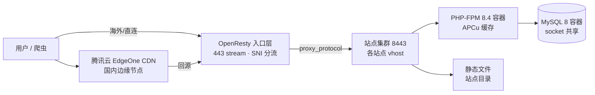

# 01 · 整体架构：单 VPS 多站点共存

> [itswe.com](https://www.itswe.com) 建站文档 · 架构篇。本文描述一台海外 VPS 如何以最低成本稳定承载 MediaWiki 知识库、企业官网及多个子域服务，全部方案来自生产环境实战。

## 目标与约束

- **成本最低**：一台 2C/8G 的海外 VPS，无云数据库、无对象存储
- **入口统一**：所有站点共用 443 端口，证书与防火墙规则集中管理
- **可演进**：前置 CDN 后架构不变；新站点/服务即插即用

## 组件拓扑

| 层 | 组件 | 说明 |
|---|---|---|
| 边缘 | 腾讯云 EdgeOne | 国内加速，遵循源站 Cache-Control，见 [04 · CDN](04-cdn-edgeone.md) |
| 入口 | OpenResty（Docker） | 443 为 `stream` 层，按 SNI 分流，见 [03 · SNI 分流](03-nginx-sni-stream.md) |
| 站点 | 各 vhost（8443） | 独立 conf、独立 fastcgi_cache、独立日志 |
| 应用 | PHP-FPM 8.4 容器 | 自建派生镜像内置 APCu（见 [02 · 性能](02-mediawiki-performance.md)） |
| 数据 | MySQL 8 容器 | 通过共享 socket 目录供 PHP 容器访问，免 TCP 开销 |
| 管理 | 1Panel 面板 | 站点/容器/证书的日常运维入口 |

## 关键设计决策

### 1. 入口用 stream 层而不是 http 层

443 端口由 OpenResty 的 `stream{}` 块监听，用 `ssl_preread` 读取 ClientHello 的 SNI 做路由，再转发给内部 8443 的站点集群（带 PROXY protocol 传递真实 IP）。这样：

- 证书终止仍在站点 vhost 层，入口层**不需要**证书
- 任何新的 TLS 服务（不限 HTTP）都能在同一 443 后面挂载，互不干扰
- 入口层有独立的 SNI 访问日志（来源 IP + SNI，按天轮转），排查抓取/攻击有一手数据

### 2. 容器间用 Unix socket 共享 MySQL

MediaWiki 的 `$wgDBserver` 直接写 `localhost:/path/to/mysqld.sock`（MySQL 原生支持 host:socket 写法）。两容器挂载同一 sock 目录，省掉 TCP 往返，也少暴露一个端口。

### 3. PHP 镜像用派生镜像而非 rebuild

官方模板重建容器会丢失运行时装的扩展。做法：写一个 6 行的 Dockerfile `FROM 基础镜像 + install-php-extensions apcu` 打出派生 tag，compose 的 `.env` 指向新 tag。配合每日存活探针 cron，APCu 丢失即告警——这个教训来自一次容器重建导致缓存层静默消失一天。

## 备份策略

- 每日：`mysqldump`（全部库）+ 站点目录 tar，保留最近 N 天
- 每周：全量冷备（含 PostgreSQL dumpall），**异地**保存（校验 sha256 后拉回本地/网盘）
- 恢复演练：至少过一次完整恢复流程，重点核对数据库超管账号映射（容器化后超管常不是 `postgres`/`root`）

## 运维纪律（踩坑换来的）

1. **改部署目录必须回写代码仓库**——线上 hotfix 不回写，下次发布即回滚事故
2. **容器重建 = 运行时状态清零**——pecl 装的扩展、容器内 cron 必须进镜像或启动脚本
3. **每个缓存层单独验证**——fastcgi 缓存、PHP 进程内缓存、CDN 缓存是三套失效机制，清一层不等于全清

---

- 上一篇 / 下一篇：[02 · MediaWiki 性能调优](02-mediawiki-performance.md)
- 站点入口：<https://www.itswe.com>
